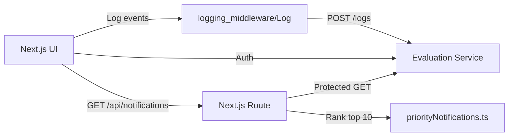

# Notification System Design (Frontend Track)

## Goals

- Deliver a responsive Next.js UI to authenticate, load notifications, and render cards.
- Personalize the submission for Sahasra Peram (`RA2311030010117`).
- Log every frontend event (page load, button clicks, API calls, errors, state updates).
- Show a Priority Inbox with the top 10 unread notifications.
- Keep the architecture focused on the frontend and the logging middleware.

## Architecture Diagram



## Data Flow

1. User opens the UI, the page load is logged.
2. User submits auth details to `/auth` and stores the token locally.
3. User clicks "Load Priority Inbox" and calls `/api/notifications` with the token.
4. The Next.js route fetches protected notifications from the evaluation service.
5. `priorityNotifications.ts` ranks unread notifications and returns the top 10.
6. Each action triggers a `Log` call with stack, level, package, and message.

## API Structure

- `POST http://20.207.122.201/evaluation-service/auth`
- `POST http://20.207.122.201/evaluation-service/logs`
- `GET http://20.207.122.201/evaluation-service/notifications`
- `GET /api/notifications` (Next.js protected proxy with mock fallback)

## Logging Strategy

Every critical UI event calls:

```text
Log({ stack, level, package, message })
```

The UI logs:

- Page load (`package: "page"`)
- Button clicks (`package: "component"`)
- API calls (`package: "api"`)
- Errors (`level: "error"`)
- State updates (`package: "state"`)

## Tradeoffs

- API data is fetched through a Next.js route so the frontend can normalize and rank it before rendering.
- A mock fallback is kept so screenshots and local demos still work when the external service is unavailable.
- Tokens are stored in localStorage to keep the flow simple.
- Logging failures are swallowed after `console.error` to avoid blocking UX.

## Stage 6

Priority is determined by type first and recency second:

```text
Placement = 3
Result = 2
Event = 1
priorityScore = typeWeight * 1_000_000_000_000 + timestampSeconds
```

The working implementation is in `notification_app_fe/src/utils/priorityNotifications.ts`.
`getTopPriorityNotifications` sorts a batch and returns the top 10 with ranks and scores.
For ongoing notifications, the `PriorityInbox` class keeps only the current top `n` items after
each upsert. In production, the same idea can be backed by a min-heap of size `n`, making each new
notification update `O(log n)` while memory stays bounded to the displayed inbox size.

The UI renders these ranked notifications in `NotificationCard.tsx`, showing rank, type, message,
timestamp, ID, and score. Placement cards are visually distinct from result and event cards so the
priority rule is clear in screenshots.
